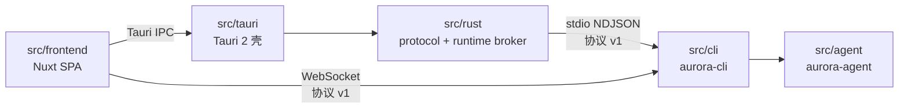

# AuroraHarness

形如 CodeX 的全平台桌面 AI Agent：用户把项目交给 Agent，Agent 会自主规划、委派并完成开发任务。

本仓库是**单仓分层**的 monorepo。历史上它由 `AuroraAgentBackend` 与 `AuroraAgentFrontend`
两个独立仓库组成，现已合并到 `src/` 之下，按职责切成五个层次，各层的提交历史都通过
subtree 合并保留（可 `git log --follow` 追溯）。

## 分层结构

```
src/
├── frontend/   前端层      Nuxt 4 + Vue 3 + TypeScript + Naive UI + Pinia（SPA）
├── tauri/      Tauri 胶水层 Tauri 2 壳：命令暴露、事件桥、系统钥匙串接线、打包配置
├── rust/       纯 Rust 层   协议 v1 契约 + Python 运行时监管与 NDJSON 代理
├── agent/      python-agent 运行时 / 委派图 / 工具 / 沙箱 / 存储 / 传输协议
└── cli/        python-cli   命令行入口：参数解析与命令分发
```

依赖方向是单向的，外层可以依赖内层，反向禁止：



两条到 Python 运行时的链路共用同一份协议与事件结构：

| 场景 | 链路 | 启动方式 |
|---|---|---|
| 浏览器开发 | 前端 → WebSocket `ws://127.0.0.1:8765/ws` | `uv run aurora runtime --port 8765` |
| 桌面应用 | 前端 → Tauri IPC → Rust broker → stdio NDJSON | Rust broker 监管 Python 子进程 |

这条边界由代码而非约定保证：`src/agent/tests/test_layering.py` 断言 agent 层不导入 cli 层，
CI 的 Rust 作业断言 broker 不依赖 tauri。

细节见 [`docs/architecture.md`](docs/architecture.md)。

## 快速开始

前置：`uv`、Node.js 24、pnpm 11、Rust stable；桌面构建还需要 Tauri 2 的系统依赖。

```bash
git clone https://github.com/AuroraBot-Dev/AuroraHarness.git
cd AuroraHarness
node scripts/tasks.mjs setup     # uv sync + pnpm install + 安装 Git 钩子
```

配置模型（密钥只写在这里，或用桌面端的系统钥匙串）：

```bash
cp src/agent/.env.example src/agent/.env
# 填写 AGENT_API_KEY / AGENT_BASE_URL / AGENT_MODEL
```

### 浏览器开发

```bash
node scripts/tasks.mjs dev-web   # 只起前端；dev 模块会自动拉起 Python 运行时
```

打开 <http://127.0.0.1:3000>。想自己掌控运行时生命周期，就用
`node scripts/tasks.mjs dev-runtime` 单独起运行时，并设置 `VITE_RUNTIME_WS` 跳过自动拉起。

### 桌面开发

```bash
node scripts/tasks.mjs dev-desktop   # Tauri 壳 + 前端热更新
```

## 任务入口

所有常见任务都走同一个 Node 入口，**不需要 make，也不需要 bash**——Windows 与 macOS 上是同一
套命令，而 Node 本来就是前端层的硬依赖：

```bash
node scripts/tasks.mjs <任务> [-- 透传参数]
node scripts/tasks.mjs help          # 列出全部任务
```

| 任务 | 作用 |
|---|---|
| `setup` | 安装全部依赖（Python 工作区 + 前端 + Git 钩子） |
| `dev-web` | 前端开发服务器（自动拉起运行时） |
| `dev-runtime` | 只起 Python 运行时（WebSocket 8765） |
| `dev-desktop` | 桌面应用开发模式 |
| `lint` / `fmt` | Python + 前端静态检查 / 自动修复 |
| `test` | 三层测试全跑一遍（等价于 `lint` + `test-python` + `test-rust` + `test-web`） |
| `test-python` / `test-rust` / `test-web` | 只跑某一层 |
| `build-sidecar` | 打包发行版用的 Python sidecar |
| `build-desktop` | 构建桌面发行包（Windows 默认只出 NSIS 的 .exe） |
| `clean` | 清理 cargo 产物、sidecar 与前端构建输出 |

想按层单独执行时也可以直接用底层命令：

```bash
# Python（仓库根：uv 工作区）
uv run pytest && uv run ruff check . && uv run pyright

# Rust
cargo test --workspace

# 前端
cd src/frontend && pnpm lint && pnpm typecheck && pnpm test
```

## 各层文档

- 前端层：[`src/frontend/README.md`](src/frontend/README.md)
- Tauri 胶水层：[`src/tauri/README.md`](src/tauri/README.md)
- 纯 Rust 层：[`src/rust/README.md`](src/rust/README.md)
- python-agent：[`src/agent/README.md`](src/agent/README.md)
- python-cli：[`src/cli/README.md`](src/cli/README.md)
- 架构与边界：[`docs/architecture.md`](docs/architecture.md)
- 架构决策记录：[`docs/adr/`](docs/adr/README.md)

## 工作区与锁定文件

仓库根同时是 uv 工作区与 cargo 工作区的根，任务入口也在这里：

```
scripts/tasks.mjs 统一任务入口（Node，跨平台）              → 无额外依赖
pyproject.toml    uv 工作区（members: src/agent, src/cli）   → uv.lock
Cargo.toml        cargo 工作区（members: src/rust/*, src/tauri）→ Cargo.lock
src/frontend/     pnpm 包                                     → pnpm-lock.yaml
```

> pnpm 必须是 **11.x**。`patches/` 下的补丁文件在 pnpm 12 上会被更严格的解析器拒绝
> （`ERR_PNPM_INVALID_PATCH`），所以 `node scripts/tasks.mjs` 在检测到其他大版本时会自动改用
> `npx pnpm@11`；用 corepack 固定版本可以省掉那次下载。

## 版本与打包

版本按 SemVer 手写、各自独立，仓库里**没有**自动发版流水线（CI 只做检查与测试）：

| 版本所在位置 | 包名 | 说明 |
|---|---|---|
| `src/agent/pyproject.toml` | `aurora-agent` | agent 层 |
| `src/cli/pyproject.toml` | `aurora-cli` | cli 层 |
| `src/frontend/package.json` | `aurora-frontend` | 前端包 |
| `src/tauri/Cargo.toml` + `tauri.conf.json` | `aurora-desktop` | **桌面应用的产品版本** |

需要出包时在本机执行：

```bash
node scripts/tasks.mjs build-desktop      # 桌面安装包（Windows 默认出 NSIS 的 .exe）
uv build --all-packages --out-dir dist    # 两个 Python 分布的 wheel/sdist
```

## 许可证

本项目采用 [MIT License](LICENSE)。
